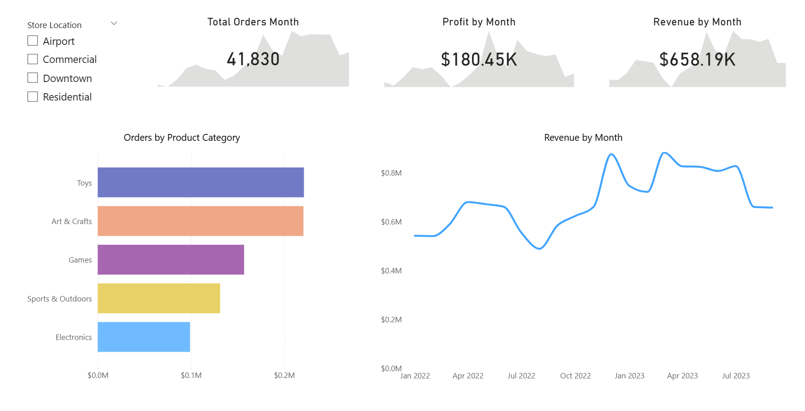

📊 Toy Store KPI Dashboard (Power BI)

## 📌 Project Overview

This project presents an interactive Power BI dashboard designed to analyze retail performance for a toy store business.
It focuses on key metrics such as **orders, revenue, and profit**, enabling data-driven insights across product categories and store locations.

---

## ❓ Business Questions Answered

* What is the overall performance of the business in terms of **orders, revenue, and profit**?
* How do **sales and profit trends** change over time?
* Which **product categories** contribute the most to business performance?
* How does performance vary across different **store locations**?
* Where are potential opportunities for improvement?

---

## 📊 Dataset Description

The dataset consists of multiple related tables:

* **Sales** → Transaction-level data (orders, units sold)
* **Products** → Product details (category, price, cost)
* **Stores** → Store information (location, type)
* **Inventory** → Stock levels across stores
* **Calendar** → Date dimension for time-based analysis

---

## 🧠 Data Modeling

* Built relationships between fact and dimension tables
* Implemented a structured model for accurate aggregation
* Enabled filtering across visuals using shared keys

---

## 🛠️ Tools & Technologies

* Power BI
* Power Query (Data Cleaning & Transformation)
* DAX (Measures & Calculations)

---

## 📈 Dashboard Features

* KPI cards for **Total Orders, Revenue, and Profit**
* Monthly trend analysis for performance tracking
* Category-wise comparison of orders
* Interactive filtering by store location
* Dynamic visual exploration of data

---

## 📸 Dashboard Preview

---

## 💡 Key Insights

* Toys and Art & Crafts categories generate the highest order volume
* Electronics shows lower performance compared to other categories
* Revenue trends indicate seasonal fluctuations
* Store location plays a significant role in performance variation

---

## 📂 Repository Structure

* `Toy Store.pbix` → Power BI dashboard
* `*.csv` → Dataset files
* `README.md` → Project documentation

---

## 🚀 Future Improvements

* Add **profit margin (%)** metric
* Implement forecasting for trend prediction
* Enhance dashboard UI/UX
* Add drill-down analysis for deeper insights

---

## 📢 Conclusion

This project demonstrates the ability to transform raw retail data into meaningful insights using Power BI, supporting business decision-making through interactive visualization.
